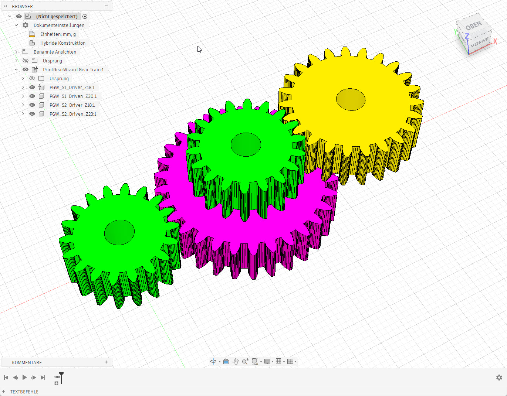
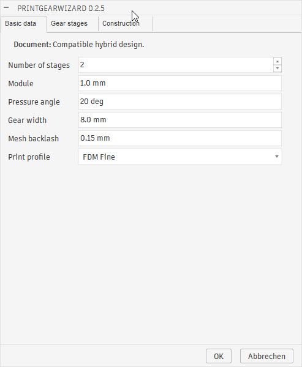
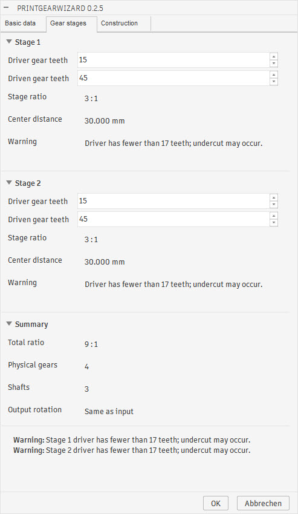
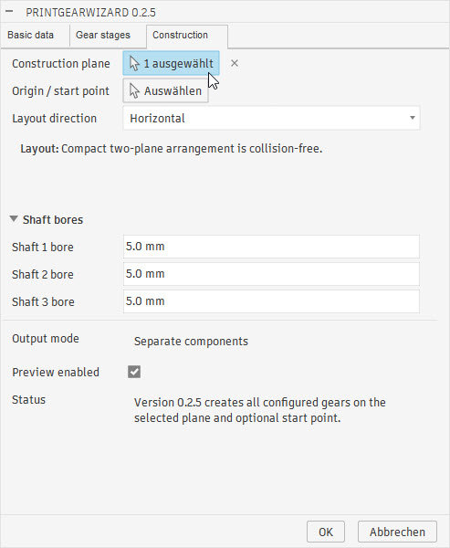

# Screenshots

## Version 0.2.5

Version 0.2.5 shows the complete workflow for configuring and generating a
two-stage gear train. The four screenshots below belong to the same example.

### Generated gear train

The completed two-stage gear train contains four separately generated gear
components arranged compactly on two construction levels.

### Basic data

The **Basic data** tab defines the number of stages and the shared gear
parameters, including module, pressure angle, gear width, backlash and the
manufacturing profile.

### Gear stages

The **Gear stages** tab configures the tooth counts and resulting transmission
ratio for each stage. The summary displays the overall ratio as well as the
required number of gears and shafts.

### Construction

The **Construction** tab selects the construction plane, origin, arrangement,
bore diameters and component output. The compact two-level arrangement includes
collision checking before the gear train is created.

